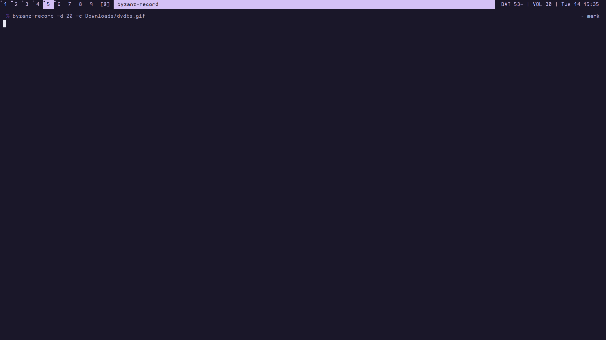

# DVDTS - DVD Term Screensaver

DVD Screensaver style screensaver for terminal.
Instead of the logo of DVD, it uses the distro name/os name or custom text.<br>

The text does not hit the corner of terminal perfectly only if GCD (greatest common divisor) for terminal dimensions isn't 1.

## Preview

Preview shows
```
dvdts -c yellow -t "Hello, World" -s 7
# and 
cowsay Hello, World | dvdts -a
```



## Usage

### Example
```
dvdts -a -c green -s 5
```
This will start the colors from green, cycle because of `a` flag, and text will move twice as fast.

### Flags
```
-a      cycle through terminal colors
-c string
        color for the bouncing text (default "blue")
-s int
        speed of text [more is slower] (default 10)
-t string
        text to display (default "<OS name>")
```

### Piping input
DVDTS supports piped input. For example
```
cowsay Hello, World | dvdts -a
```

### In-use bindings
|Key(s)     |Action    |
|-----------|----------|
|q or Ctrl+c|Quit      |
|a|Toggle color cycling|

## Build Dependencies
- [Go](https://golang.org/)
- [termui](https://github.com/gizak/termui)

